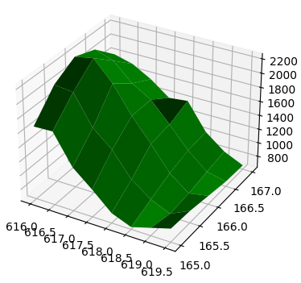

<a name="readme-top"></a>

<p align="center">
  <a href="https://github.com/adkoprek/3D/graphs/contributors">
	  
  </a>
  <a href="https://github.com/adkoprek/3D/network/members">
	  
  </a>
  <a href="https://github.com/adkoprek/3D/stargazers">
	  
  </a>
  <a href="https://github.com/adkoprek/3D/issues">
	  
  </a>
  <a href="https://github.com/adkoprek/3D/blob/master/LICENSE.txt">
	  
  </a>
</p>
<br />

<br />
<div align="center">
  <a href="https://github.com/adkoprek/3D">
    
  </a>

  <h3 align="center">3D - 3D Visualizer</h3>

  <p align="center">
    An awesome visualizer for 3D points in python
    <br />
    <a href="https://github.com/adkoprek/3D/issues/new?labels=bug&template=bug-report---.md">Report Bug</a>
    ·
    <a href="https://github.com/adkoprek/3D/issues/new?labels=enhancement&template=feature-request---.md">Request Feature</a>
  </p>
</div>

## About The Project

<p align="center">
  
</p>

This is a cool way to visualize some 3D points with python and matpolitlib. The code at the moment is inspired of a task from the Mathbuch 3 that is used in Swizerland in middle schools.

### Built With
[![Python][py.js]][py-url]

## Getting Started

If you want your own copy just follow this steps

```bash
git clone https://github.com/adkoprek/3D
```

### Prerequisites

A browser

## Usage

You can open this website over this [link](https://stately-caramel-8051c9.netlify.app)

## Contributing

Contributions are what make the open source community such an amazing place to learn, inspire, and create. Any contributions you make are **greatly appreciated**.

If you have a suggestion that would make this better, please fork the repo and create a pull request. You can also simply open an issue with the tag "enhancement".
Don't forget to give the project a star! Thanks again!

1. Fork the Project
2. Create your Feature Branch (`git checkout -b feature/AmazingFeature`)
3. Commit your Changes (`git commit -m 'Add some AmazingFeature'`)
4. Push to the Branch (`git push origin feature/AmazingFeature`)
5. Open a Pull Request

## License

Distributed under the MIT License. See `LICENSE.txt` for more information.

## Contact

Adam Korpek - adam.koprek@edu.schulen-Turgi.ch

[contributors-shield]: https://img.shields.io/github/contributors/othneildrew/Best-README-Template.svg?style=for-the-badge
[contributors-url]: https://github.com/adkoprek/WTE/graphs/contributors
[forks-shield]: https://img.shields.io/github/forks/othneildrew/Best-README-Template.svg?style=for-the-badge
[forks-url]: https://github.com/adkoprek/WTE/network/members
[stars-shield]: https://img.shields.io/github/stars/othneildrew/Best-README-Template.svg?style=for-the-badge
[stars-url]: https://github.com/adkoprek/WTE/stargazers
[issues-shield]: https://img.shields.io/github/issues/othneildrew/Best-README-Template.svg?style=for-the-badge
[issues-url]: https://github.com/adkoprek/WTE/issues
[license-shield]: https://img.shields.io/github/license/othneildrew/Best-README-Template.svg?style=for-the-badge
[license-url]: https://github.com/adkoprek/WTE/blob/master/LICENSE.txt
[product-screenshot]: images/screenshot.png
[py.js]: https://img.shields.io/badge/Python-FFD43B?style=for-the-badge&logo=python&logoColor=blue
[py-url]: https://python.org
